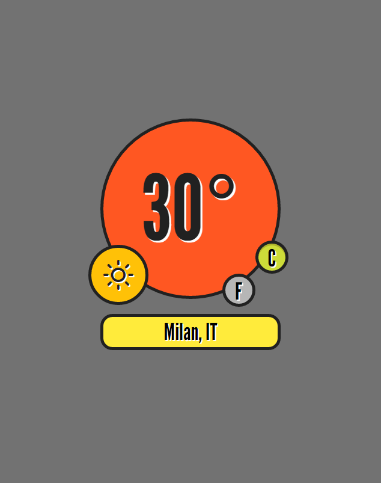

#jsWeather
Local weather app for FreeCodeCamp zipline: https://www.freecodecamp.com/challenges/show-the-local-weather

#Preview as of 18-jun-16

###[Demo](http://iamsquare.it/weather/)

Extensions used:
* [domReady](https://github.com/ded/domready)
* [bonzo](https://github.com/ded/bonzo)
* [qwery](https://github.com/ded/qwery)
* [reqwest](https://github.com/ded/reqwest)
* [bean](https://github.com/fat/bean)
* [Weather-icons](http://erikflowers.github.io/weather-icons/)
